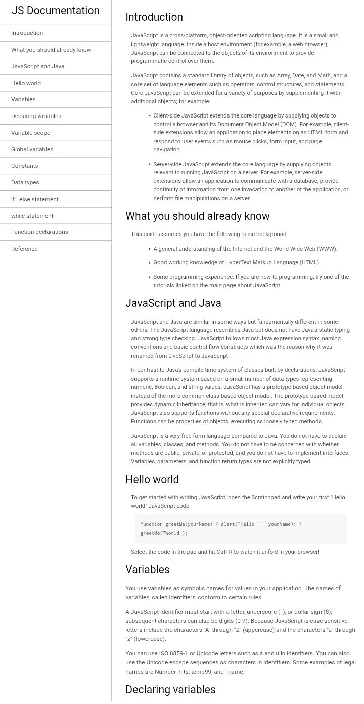

# 📚 Página de Documentación Técnica


Este proyecto consiste en una **página de documentación técnica** desarrollada con HTML y CSS.

Forma parte del curso **Responsive Web Design** de FreeCodeCamp y tiene como objetivo construir una página con navegación lateral que permita acceder rápidamente a diferentes secciones de contenido técnico.

---

## 🚀 Demo

[](https://carlosdm121.github.io/pagina-de-documentacion-tecnica/)

---

## 🖼 Vista del proyecto



---

## 🛠 Tecnologías utilizadas

<p>

</p>

- HTML5  
- CSS3  

---

## 📂 Características

✔ Navegación lateral fija  
✔ Enlaces internos entre secciones  
✔ Secciones de documentación organizadas  
✔ Uso de etiquetas semánticas  
✔ Diseño simple y claro

---

## 📚 Estructura de la página

La página está compuesta por:

- **Navbar lateral** con enlaces a cada sección  
- **Secciones de documentación** con contenido técnico  
- Fragmentos de código y explicaciones  
- Navegación mediante enlaces internos

Este tipo de página es común en la documentación de lenguajes de programación y bibliotecas, donde cada sección explica un concepto o funcionalidad específica. 1

---

## 📦 Instalación

1. Clonar el repositorio

```bash
git clone https://github.com/carlosdm121/pagina-de-documentacion-tecnica.git
```

2. Entrar en la carpeta

```
cd pagina-de-documentacion-tecnica
```

3. Abrir el archivo

```
index.html
```

---

## 📚 Aprendizajes del proyecto

Este proyecto permite practicar:

- Navegación interna con anclas
- Organización de documentación técnica
- Maquetación con HTML y CSS
- Creación de interfaces tipo documentación

---

## 👨‍💻 Autor

Desarrollado por **Carlos Daniel Martínez**

🔗 GitHub  
https://github.com/carlosdm121
